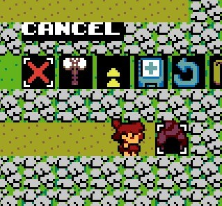

# UFO 50 Mod - Save between waves in Rock-on! Island
- Allows you to create save states between waves within a level so you don't have to reset the whole level. 
- Compatible with UFO 50 v1.7.5
- Running a previous version of UFO 50? Check [the archive](/archive)

Thanks to [JoshPennPierson](https://github.com/JoshPennPierson) for the [helpful tutorial on saving object states](https://github.com/Game-Development-Resources/Saving-Object-States-Between-Rooms/tree/master).

## How to Install the Mod

Note: Installing untrusted mods is risky. Install at your own risk. 

1. Download and install [Delta Patcher](https://github.com/marco-calautti/DeltaPatcher/releases)
2. Download the [.xdelta file](/ROCK_UNDO_v1.7.5.xdelta) for the mod
3. Navigate to Game Files Directory - `C:\Program Files (x86)\Steam\steamapps\common\UFO 50` and find `data.win`
4. You should make a copy of your `data.win` before installing the mod
5. Run Delta Patcher, select `data.win` as the Original file and the `.xdelta` file as the Patch and click Apply patch.

## Features
Adds two new icons to the player menu when cursor is over Path, Stony Ground, or the Cave:

### Create Save Point

- Stores position of every Tower, Fire, Chicken, Bush & Boulder
- Stores current Wave, total Meat, remaining Health
- Stores Player position and Weapon upgrades
- Only available during the Build phase between Waves
- Once you leave a level, save data will be lost
  
### Load Save Point

- Available during Build phase or Attack phase
- Resets the game to the previously stored state
- If player tries to Load when not possible, error messages are shown

### Known Issues

- When using menus at the edge of the screen menu items some times go off screen
- The player's cursor may be in the wrong position on load, but as soon as the player moves it returns in place
- If the current level has multiple screens, the camera may jump suddenly on load

  

